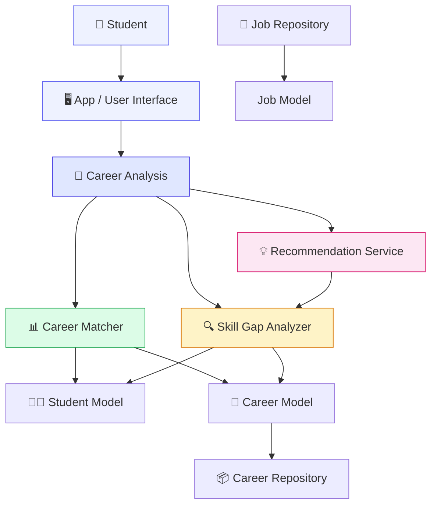
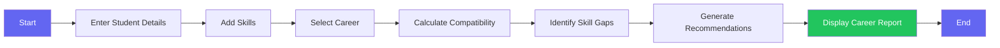
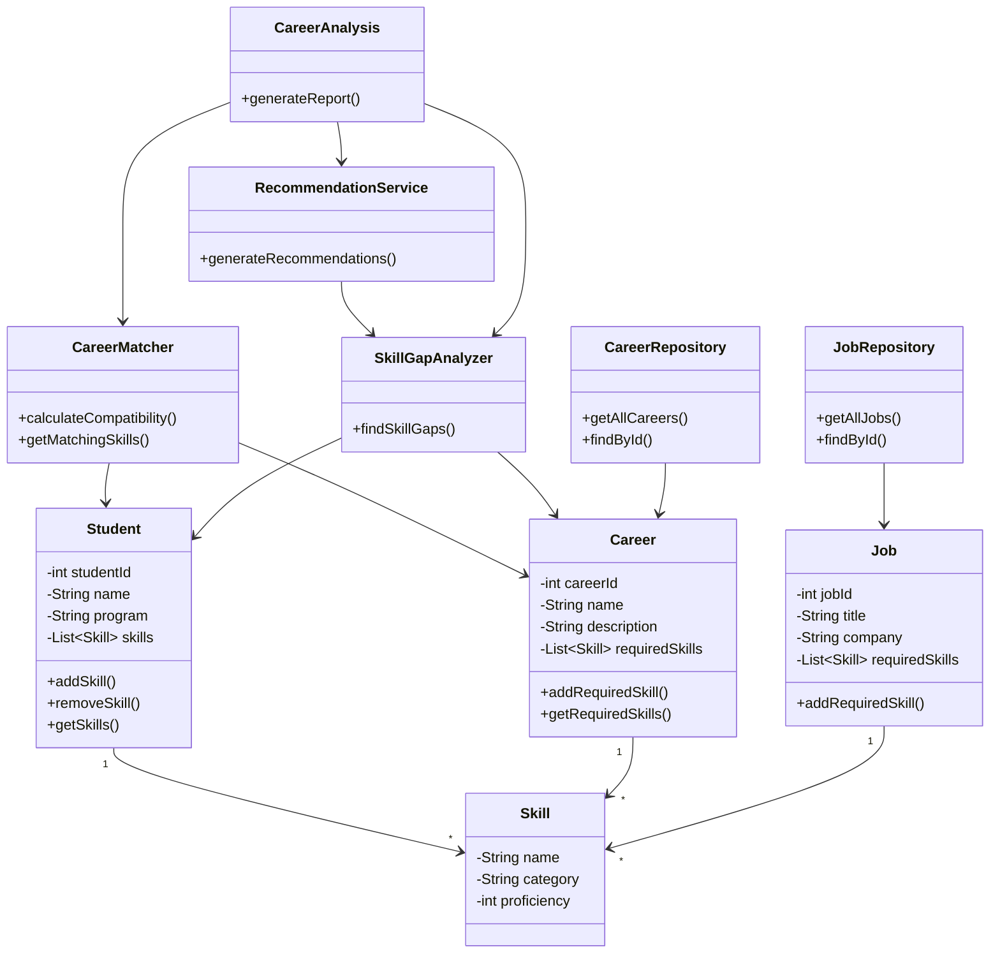
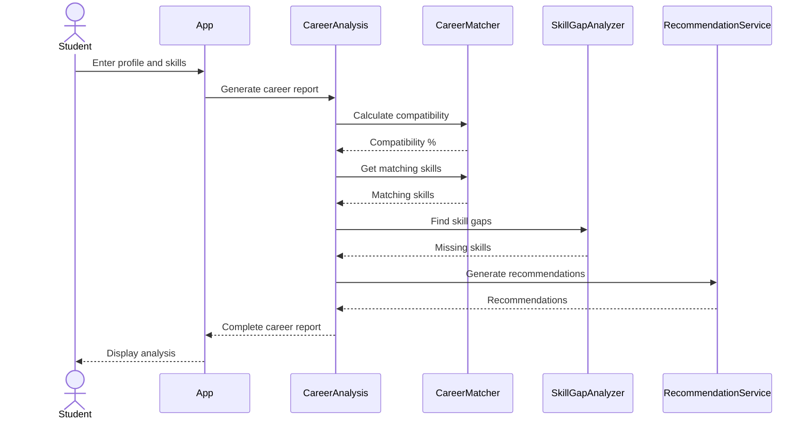
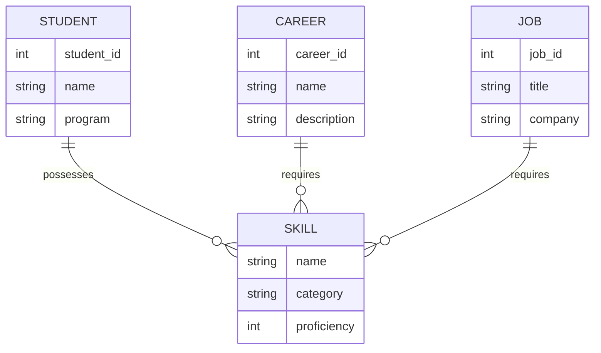
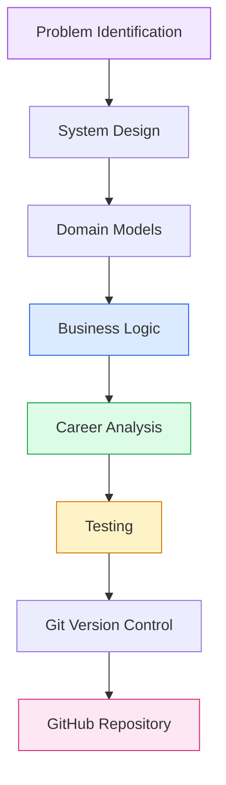

<p align="center">
  
</p>

<p align="center">

  
  
  
  

</p>

<p align="center">

  
  
  

</p>

---

# 🧠 NEXUS — Career Intelligence System

> **A Java-based career intelligence application that analyzes a student's skills, measures compatibility with a career path, identifies skill gaps, and generates personalized recommendations.**

NEXUS is designed around a simple idea:

**Understand where a student is → identify where they want to go → find the gap → recommend what to improve.**

---

## ✨ What is NEXUS?

Choosing a career can be difficult when students don't know:

- 🧩 Which skills they already possess
- 📊 How well their current profile matches a career
- 🔍 Which required skills they are missing
- 🚀 What they should focus on learning next

**NEXUS** addresses this through a structured career-analysis workflow.

The application takes a student's:

```text
Personal Information
        +
Current Skills
        +
Skill Proficiency
        ↓
Career Requirements
        ↓
Compatibility Analysis
        ↓
Skill Gap Detection
        ↓
Personalized Recommendations
```

---

# 🎯 Core Objectives

| Objective | Description |
|---|---|
| 🎓 Student Profiling | Store student information and current skills |
| 🧠 Career Matching | Calculate compatibility between a student and career |
| 🔍 Skill Gap Analysis | Identify skills required but currently missing |
| 💡 Recommendations | Generate actionable learning recommendations |
| 🏗️ Modular Design | Separate models, services and repositories |
| 🧪 Testing | Validate core application behaviour using JUnit |

---

# 🚀 Key Features

### 👤 Student Profile

The system collects:

- Student name
- Academic program
- Current technical skills
- Skill proficiency levels

---

### 🎯 Career Compatibility

NEXUS compares the student's skills with the skills required by a career.

Example:

```text
Required Skills
────────────────────────────
Java
SQL
Git
OOP
Data Structures

Student Skills
────────────────────────────
Java
Git
OOP

             ↓

Compatibility
      60%
```

---

### 🔍 Skill Gap Analysis

Missing skills are automatically identified.

```text
Career Requirements
        │
        ├── Java              ✓
        ├── SQL               ✗
        ├── Git               ✓
        ├── OOP               ✓
        └── Data Structures   ✗
                               
        ↓

Skill Gaps
───────────────
• SQL
• Data Structures
```

---

### 💡 Personalized Recommendations

Based on the identified gaps, NEXUS generates recommendations such as:

```text
→ Learn or improve: SQL
→ Learn or improve: Data Structures
→ Practice the missing skills through projects
→ Review your progress regularly
```

---

# 🏗️ System Architecture

NEXUS follows a **modular layered architecture**.



---

# 🔄 Application Workflow



---

# 🧩 Class Structure



---

# 🔁 Sequence Diagram

The following sequence shows how NEXUS generates a career analysis.



---

# 🧠 Core Algorithm

NEXUS currently calculates compatibility using the proportion of required skills that match the student's skills.

### Formula

```text
                 Matching Skills
Compatibility = ─────────────────── × 100
                 Required Skills
```

### Example

If a career requires:

```text
Java
SQL
Git
OOP
Data Structures
```

and the student has:

```text
Java ✓
SQL  ✗
Git  ✓
OOP  ✓
DS   ✗
```

Then:

```text
Matching Skills = 3
Required Skills = 5

Compatibility = (3 / 5) × 100

              = 60%
```

---

# 📊 Example NEXUS Output

```text
========================================
          NEXUS CAREER REPORT
========================================

Student: Sanchita Yadav
Program: B.Tech CSE
Career: Java Developer

Compatibility: 60.0%

Matching Skills:
- Java
- Git
- OOP

Skill Gaps:
- SQL
- Data Structures

Recommendations:
- Learn or improve: SQL
- Learn or improve: Data Structures
- Practice the missing skills through projects and exercises.
- Review your progress regularly and update your skill profile.

========================================
```

---

# 📁 Project Structure

```text
NEXUS-Career-Intelligence/
│
├── 📄 README.md
├── 📄 pom.xml
├── 📄 .gitignore
├── 📄 statement.md
├── 🎨 nexus-banner.svg
│
├── 📁 docs/
│   ├── architecture.md
│   ├── class-diagram.md
│   ├── database-design.md
│   ├── sequence-diagram.md
│   ├── use-case.md
│   └── workflow.md
│
└── 📁 src/
    │
    ├── 📁 main/
    │   └── 📁 java/
    │       └── 📁 com/
    │           └── 📁 nexus/
    │
    │               ├── App.java
    │               │
    │               ├── 📁 model/
    │               │   ├── Career.java
    │               │   ├── Job.java
    │               │   ├── Skill.java
    │               │   └── Student.java
    │               │
    │               ├── 📁 repository/
    │               │   ├── CareerRepository.java
    │               │   └── JobRepository.java
    │               │
    │               └── 📁 service/
    │                   ├── CareerAnalysis.java
    │                   ├── CareerMatcher.java
    │                   ├── RecommendationService.java
    │                   └── SkillGapAnalyzer.java
    │
    └── 📁 test/
        └── 📁 java/
            └── 📁 com/
                └── 📁 nexus/
                    └── AppTest.java
```

---

# 🧱 Architecture Layers

## 🖥️ Application Layer

**`App.java`**

Handles:

- User interaction
- Input collection
- Application flow
- Displaying the final report

---

## 🧠 Service Layer

Located in:

```text
service/
```

### CareerAnalysis

Coordinates the complete career analysis.

### CareerMatcher

Calculates career compatibility and matching skills.

### SkillGapAnalyzer

Identifies missing career-required skills.

### RecommendationService

Generates learning recommendations based on identified gaps.

---

## 📦 Model Layer

Located in:

```text
model/
```

Contains the main entities:

```text
Student
Skill
Career
Job
```

These classes represent the core data structures used by the application.

---

## 🗂️ Repository Layer

Located in:

```text
repository/
```

Responsible for providing career and job data to the application.

Current repositories:

```text
CareerRepository
JobRepository
```

---

# 🛠️ Technology Stack

<p align="center">


</p>

### Programming

`Java 17`

### Build Management

`Apache Maven`

### Testing

`JUnit 5`

### Version Control

`Git`

### Repository Hosting

`GitHub`

---

# 🧪 Testing

The project uses **JUnit 5** for automated testing.

Run the complete test suite with:

```bash
mvn clean test
```

Expected result:

```text
Tests run: 2
Failures: 0
Errors: 0

BUILD SUCCESS
```

---

# ▶️ Running the Application

## 1. Clone the repository

```bash
git clone https://github.com/sanchita25bai11100/NEXUS-Career-Intelligence.git
```

## 2. Navigate into the project

```bash
cd NEXUS-Career-Intelligence
```

## 3. Run tests

```bash
mvn clean test
```

## 4. Run the application

```bash
mvn exec:java "-Dexec.mainClass=com.nexus.App"
```

---

# 📋 Requirements

Before running NEXUS, make sure you have:

| Requirement | Version |
|---|---|
| ☕ Java | 17+ |
| 📦 Maven | 3.9+ |
| 🔧 Git | Latest recommended |
| 💻 IDE | VS Code / IntelliJ IDEA / Eclipse |

---

# 🗃️ Data Design

The current implementation uses Java collections for in-memory data management.



The repository layer currently provides sample career and job data. A persistent database can be introduced as a future extension.

---

# 🔮 Future Enhancements

NEXUS can be extended into a more complete career intelligence platform.

### Possible future features

- 🌐 Web-based user interface
- 🗄️ Persistent database integration
- 📚 Learning-resource recommendations
- 💼 Real-time job matching
- 📈 Skill-progress tracking
- 📊 Career comparison dashboard
- 🤖 Machine-learning-based recommendations
- 🔐 User authentication
- ☁️ Cloud deployment
- 📱 Mobile application

---

# 📚 Documentation

Detailed project documentation is available in the `docs/` directory.

| Document | Purpose |
|---|---|
| 🏗️ `architecture.md` | System architecture |
| 🧩 `class-diagram.md` | Class relationships |
| 🗃️ `database-design.md` | Data design |
| 🔄 `sequence-diagram.md` | System interactions |
| 👤 `use-case.md` | User interactions |
| 🔀 `workflow.md` | Application workflow |

---

# 🎓 Academic / Project Relevance

NEXUS demonstrates several important software engineering concepts:

```text
Object-Oriented Programming
        ↓
Java Classes & Objects
        ↓
Collections & Data Structures
        ↓
Layered Architecture
        ↓
Repository Pattern
        ↓
Service-Based Business Logic
        ↓
Unit Testing
        ↓
Git & GitHub Version Control
        ↓
Maven Build Management
```

The project provides a foundation for implementing a larger career intelligence system while keeping the current implementation modular and understandable.

---

# 📈 Development Flow



---

# 🌟 Why NEXUS?

NEXUS brings several pieces of career planning into a single workflow:

```text
        👤
      Student
         │
         ▼
   🧠 Skill Profile
         │
         ▼
   🎯 Career Matching
         │
         ▼
    🔍 Skill Gaps
         │
         ▼
   💡 Recommendations
         │
         ▼
   🚀 Career Direction
```

Instead of simply showing a career name, the system explains the relationship between:

**what the student knows → what the career requires → what is missing → what to improve.**

---

# 👩‍💻 Author

<p align="center">

### Sanchita Yadav

**B.Tech Computer Science & Engineering — AI & ML**

VIT Bhopal University

</p>

---

<p align="center">


### 🧠 NEXUS

**Understand your skills. Discover your gaps. Build your future.**

⭐ If you find this project interesting, consider giving the repository a star.

</p>
