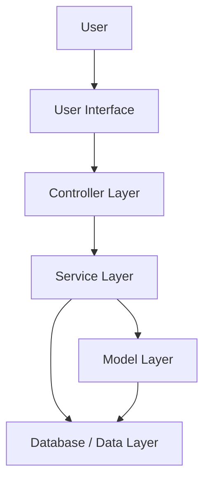

# NEXUS System Architecture

## Overview

NEXUS follows a modular layered architecture. The system separates user interaction, application control, business logic, data models, and data storage.

## Architecture Diagram

## Layers

### 1. User Interface Layer

Handles interaction between the user and the NEXUS application.

Responsibilities:

- Accept user input
- Display career analysis
- Display skill gaps
- Display recommendations

### 2. Controller Layer

Controls application flow and connects the user interface with the service layer.

### 3. Service Layer

Contains the main business logic of NEXUS.

Responsibilities:

- Career compatibility analysis
- Skill gap analysis
- Job matching
- Recommendation generation

### 4. Model Layer

Represents the main entities of the system.

Examples:

- Student
- Skill
- Career
- Job
- Recommendation

### 5. Database / Data Layer

Responsible for storing and retrieving application data.

## Design Goal

The architecture keeps the application modular so that individual components can be developed, tested, and maintained independently.