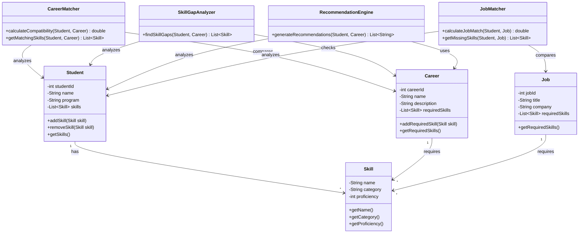

# NEXUS Class Diagram

## Overview

The class structure of NEXUS is designed using Object-Oriented Programming principles. The system separates data entities from the services responsible for processing career and skill information.

## Class Diagram



## Main Classes

### Student

Represents the student whose skills are being analyzed.

Responsibilities:

- Store student information
- Maintain the student's skill collection
- Add and remove skills
- Provide student data to analysis services

---

### Skill

Represents an individual skill.

Attributes include:

- Skill name
- Skill category
- Proficiency level

Examples:

```text
Java
Python
SQL
Data Structures
Git
```

---

### Career

Represents a career role and its required skills.

Examples:

```text
Java Developer
Data Analyst
Software Engineer
Web Developer
```

---

### Job

Represents a job opportunity or job profile containing required skills.

The Job class allows NEXUS to compare a student's profile with job requirements.

---

### CareerMatcher

Responsible for calculating the compatibility between a student's skills and a career's requirements.

---

### SkillGapAnalyzer

Responsible for identifying required skills that are missing or insufficient in the student's profile.

---

### RecommendationEngine

Responsible for generating recommendations based on career requirements and identified skill gaps.

---

### JobMatcher

Responsible for comparing a student's skills with the requirements of a job profile.

---

## Relationships

The main relationships are:

```text
Student
   |
   | has
   v
Skill

Career
   |
   | requires
   v
Skill

Job
   |
   | requires
   v
Skill

Student + Career
       |
       v
CareerMatcher
       |
       v
Compatibility

Student + Career
       |
       v
SkillGapAnalyzer
       |
       v
Skill Gaps

Skill Gaps + Career
       |
       v
RecommendationEngine
       |
       v
Recommendations
```

## Object-Oriented Design

The class structure demonstrates:

- Encapsulation through private attributes
- Abstraction through service classes
- Composition between students, careers, jobs, and skills
- Separation of data models and business logic
- Modular service-based design