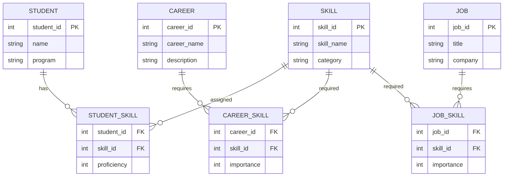

# NEXUS Database Design

## Overview

NEXUS requires structured storage for student profiles, skills, career roles, job profiles, and their relationships.

The proposed database design uses a relational structure so that student information and career requirements can be stored and retrieved efficiently.

## Entity Relationship Diagram



## Entities

### STUDENT

Stores information about students using the system.

| Field | Type | Description |
|---|---|---|
| student_id | INT | Unique student identifier |
| name | VARCHAR | Student name |
| program | VARCHAR | Academic program |

---

### SKILL

Stores the skills available within the system.

| Field | Type | Description |
|---|---|---|
| skill_id | INT | Unique skill identifier |
| skill_name | VARCHAR | Name of the skill |
| category | VARCHAR | Skill category |

Examples:

- Programming
- Database
- Web Development
- Data Science
- Version Control

---

### STUDENT_SKILL

Connects students with their skills.

| Field | Type | Description |
|---|---|---|
| student_id | INT | Student reference |
| skill_id | INT | Skill reference |
| proficiency | INT | Proficiency level |

The relationship allows one student to have multiple skills and one skill to belong to multiple students.

---

### CAREER

Stores available career roles.

| Field | Type | Description |
|---|---|---|
| career_id | INT | Unique career identifier |
| career_name | VARCHAR | Career name |
| description | TEXT | Career description |

Examples:

- Java Developer
- Data Analyst
- Software Engineer
- Web Developer

---

### CAREER_SKILL

Connects careers with the skills they require.

| Field | Type | Description |
|---|---|---|
| career_id | INT | Career reference |
| skill_id | INT | Required skill |
| importance | INT | Relative importance |

---

### JOB

Stores job profiles.

| Field | Type | Description |
|---|---|---|
| job_id | INT | Unique job identifier |
| title | VARCHAR | Job title |
| company | VARCHAR | Company name |

---

### JOB_SKILL

Connects jobs with their required skills.

| Field | Type | Description |
|---|---|---|
| job_id | INT | Job reference |
| skill_id | INT | Required skill |
| importance | INT | Relative importance |

---

## Relationships

The main relationships are:

```text
Student
   |
   | has
   v
Student Skill
   |
   v
Skill


Career
   |
   | requires
   v
Career Skill
   |
   v
Skill


Job
   |
   | requires
   v
Job Skill
   |
   v
Skill
```

## Database Design Principles

The proposed structure uses separate entities to reduce unnecessary duplication.

For example, a skill such as `Java` is stored once in the `SKILL` entity and can then be associated with multiple students, careers, and jobs through relationship tables.

This structure also makes it easier to add new careers and skills without changing the overall database design.

## Data Integrity

The database design uses primary keys to uniquely identify records and foreign keys to maintain relationships between entities.

Examples:

- `student_id` identifies a student.
- `skill_id` identifies a skill.
- `career_id` identifies a career.
- `job_id` identifies a job.

## Implementation Note

The database layer is part of the planned NEXUS architecture. The final implementation will determine the specific database technology and connection approach used by the application.