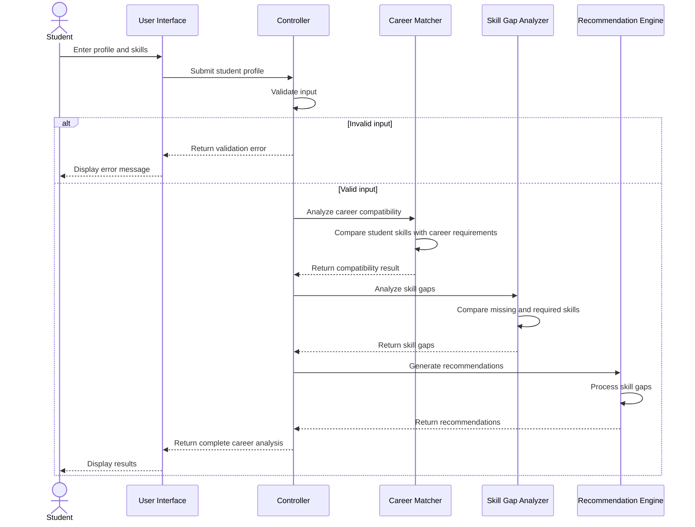

# NEXUS Sequence Diagram

## Overview

The sequence diagram shows the interaction between the student, user interface, controller, and service components during a career analysis.

## Career Analysis Sequence



## Interaction Steps

### 1. Student Input

The student enters their profile information and current skills.

### 2. Input Validation

The controller validates the submitted information.

If the input is invalid, an error message is returned to the user.

### 3. Career Compatibility

For valid input, the controller sends the student profile and selected career to the Career Matcher.

The Career Matcher compares the student's skills against the career requirements.

### 4. Skill Gap Analysis

The Skill Gap Analyzer determines which required skills are missing or insufficient.

### 5. Recommendation Generation

The Recommendation Engine processes the identified skill gaps and generates suggestions for improvement.

### 6. Result Display

The complete analysis is returned to the user interface and displayed to the student.

## Sequence Summary

```text
Student
   |
   v
User Interface
   |
   v
Controller
   |
   +----> Career Matcher
   |          |
   |          v
   |     Compatibility
   |
   +----> Skill Gap Analyzer
   |          |
   |          v
   |       Skill Gaps
   |
   +----> Recommendation Engine
              |
              v
        Recommendations
              |
              v
        User Interface
              |
              v
           Student
```

## Expected Result

The sequence demonstrates how NEXUS processes a student's information through multiple services before presenting a consolidated career analysis.