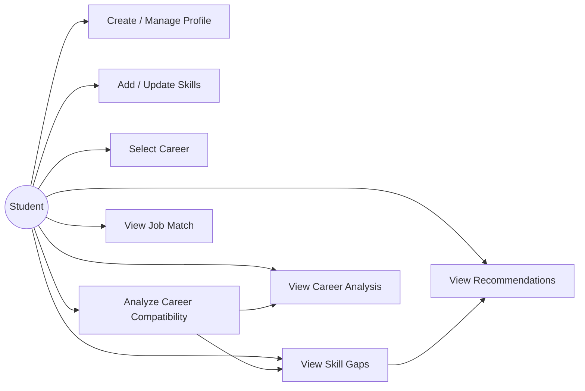

# NEXUS Use Case Diagram

## Overview

The Use Case Diagram represents the main interactions between the user and the NEXUS Career Intelligence System.

The primary actor is the **Student**, who interacts with the system to manage their profile, analyze career compatibility, identify skill gaps, and receive recommendations.

## Use Case Diagram



## Primary Actor

### Student

The student is the primary user of NEXUS.

The student can:

- Create a profile
- Manage personal information
- Add skills
- Update skill proficiency
- Select a career
- Analyze career compatibility
- Identify skill gaps
- View job matching information
- View recommendations
- Review the final career analysis

## Main Use Cases

### 1. Manage Profile

The student provides and manages their basic profile information.

**Input:**
- Student ID
- Name
- Academic information

**Output:**
- Updated student profile

---

### 2. Manage Skills

The student adds or updates their current skills.

**Input:**
- Skill name
- Skill category
- Proficiency level

**Output:**
- Updated skill profile

---

### 3. Select Career

The student selects a career role for analysis.

**Input:**
- Career role

**Output:**
- Selected career and its requirements

---

### 4. Analyze Career Compatibility

The system compares the student's skills with the selected career requirements.

**Input:**
- Student skills
- Career requirements

**Output:**
- Compatibility percentage
- Matching skills

---

### 5. Identify Skill Gaps

The system identifies skills required by the selected career that are missing or insufficient in the student's profile.

**Input:**
- Student skill profile
- Career requirements

**Output:**
- Skill gap list

---

### 6. View Job Match

The system compares the student's skills with job requirements.

**Input:**
- Student skills
- Job requirements

**Output:**
- Job compatibility information
- Matching skills
- Missing requirements

---

### 7. View Recommendations

The system generates suggestions based on identified skill gaps.

**Input:**
- Skill gaps
- Compatibility analysis

**Output:**
- Recommended skills
- Suggested improvement areas

---

### 8. View Career Analysis

The student receives a consolidated analysis containing:

- Career compatibility
- Matching skills
- Skill gaps
- Recommendations

## Use Case Relationship

The general relationship between the major use cases is:

```text
Manage Profile
      |
      v
Manage Skills
      |
      v
Select Career
      |
      v
Career Compatibility Analysis
      |
      +-------> Skill Gap Analysis
      |               |
      |               v
      |        Recommendations
      |
      +-------> Job Matching
      |
      v
Career Analysis
```

## Expected Outcome

The Use Case model provides a clear representation of how a student interacts with NEXUS and how the system transforms the student's input into career-related analysis and recommendations.