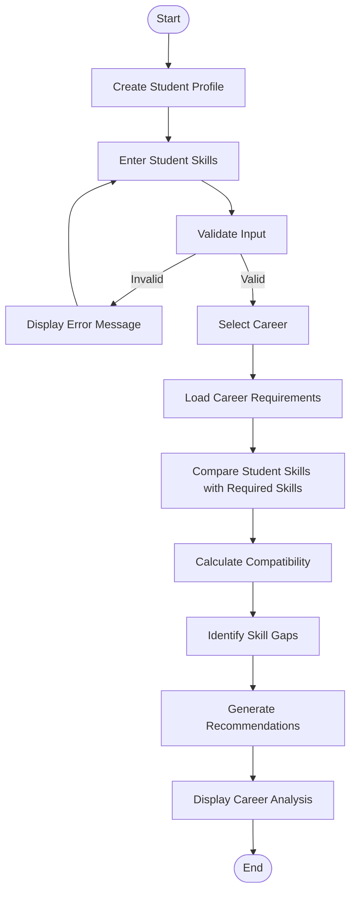

# NEXUS Workflow

## Overview

The NEXUS workflow describes how a student's information moves through the system to produce career compatibility results, skill-gap analysis, and recommendations.

## Workflow Diagram



## Step-by-Step Process

### Step 1 — Create Student Profile

The user provides basic information required to create a student profile.

Example information:

- Student ID
- Student name
- Academic program
- Career interests

### Step 2 — Enter Skills

The student enters their current skills and, where applicable, their proficiency levels.

Example:

```text
Java       → Advanced
SQL        → Intermediate
Git        → Intermediate
Python     → Beginner
```

### Step 3 — Validate Input

The system checks whether the provided information is valid.

Examples of invalid input:

- Empty student name
- Empty skill name
- Invalid proficiency level
- Invalid numerical input

If invalid information is entered, the system displays an appropriate error message and requests valid input.

### Step 4 — Select Career

The user selects a career role they want to analyze.

Example:

```text
Java Developer
```

### Step 5 — Load Career Requirements

The system retrieves the skills associated with the selected career.

Example:

```text
Java Developer

Required Skills:
- Java
- OOP
- SQL
- Git
- Data Structures
```

### Step 6 — Skill Comparison

The system compares the student's current skills with the required career skills.

The comparison identifies:

- Matching skills
- Missing skills
- Skills requiring improvement

### Step 7 — Compatibility Calculation

The system calculates a compatibility percentage based on the implemented matching algorithm.

A basic calculation can be represented as:

```text
Compatibility =
(Matching Required Skills / Total Required Skills) × 100
```

### Step 8 — Skill Gap Analysis

The system identifies skills required for the selected career that are missing or insufficient in the student's profile.

### Step 9 — Recommendation Generation

The recommendation module uses the compatibility results and identified skill gaps to generate suggestions for improvement.

### Step 10 — Display Results

The system displays the final career analysis to the user.

Example:

```text
Career: Java Developer

Compatibility: 80%

Matching Skills:
- Java
- OOP
- Git
- Data Structures

Skill Gaps:
- SQL

Recommendation:
Improve SQL skills to better satisfy the career requirements.
```

## Workflow Summary

```text
Student Input
      ↓
Input Validation
      ↓
Skill Processing
      ↓
Career Requirement Retrieval
      ↓
Skill Matching
      ↓
Compatibility Calculation
      ↓
Skill Gap Analysis
      ↓
Recommendation Generation
      ↓
Career Analysis Output
```